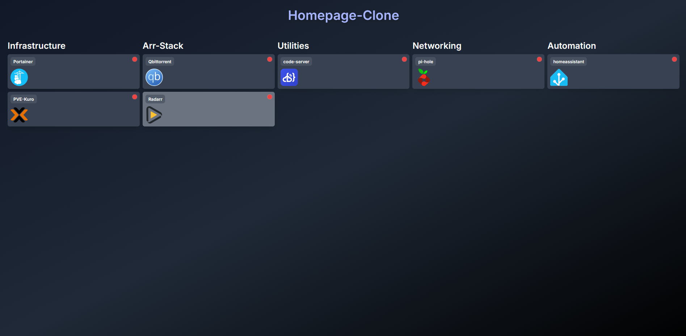

# 🖥️ My Self-Hosted Dashboard

> A minimal, responsive, and extensible dashboard built from scratch as a learning project — inspired by [Homepage](https://github.com/benphelps/homepage).

---

## 📸 Preview



---

## 📚 About

This project is a lightweight, educational self-hosted dashboard made with **vanilla HTML, Tailwind CSS, and JavaScript**.

It was created to explore:

- Working with **YAML configuration files**
- Dynamically rendering UI based on data
- Basic **status checking** using `fetch()` and timeouts
- Leveraging **TailwindCSS utility classes** for fast styling
- Making layout decisions (rows vs columns) and building **responsive UIs**
- Supporting both **PNG and SVG** icons from [homarr-labs/dashboard-icons](https://github.com/homarr-labs/dashboard-icons)

It is not meant to replace a production-grade dashboard like [Homepage](https://github.com/benphelps/homepage), but rather to **learn by doing**.

---

## 🚀 Features

- 📁 **YAML-based configuration** (easy to edit services & layout)
- 🖼️ Icon support for both `.png` and `.svg` formats
- 🌐 Status indicator with animated ping (green = reachable, red = unreachable)
- 📱 Fully responsive: columns adapt to screen size
- 🗂️ Auto-grouping by service category
- 🧩 Clean, minimal UI using TailwindCSS

---
## ⚙️ How to Use

1. Clone the repo:

```bash
git clone https://github.com/your-username/self-hosted-dashboard.git
cd self-hosted-dashboard
```

2. Copy the example config file:
Rename example-data.yaml to data.yaml and customize it to suit your services:

```bash
cp example-data.yaml data.yaml
```

3. Edit data.yaml with your service details:

```yaml
layout: columns # Two options: 'columns' or 'rows'
services:
  - name: My Service
    url: https://example.com
    icon: my-icon.svg # Check https://github.com/homarr-labs/dashboard-icons
    category: Dev Tools
    statusCheck: https://example.com # Dummy check – does not yet support CORS-restricted scenarios
```

4. Open index.html in your browser to view the dashboard. (More functionality — including Docker support — will be added as the project evolves.)

## 🧠 Inspiration

This project was inspired by the amazing Homepage dashboard, but built from scratch to better understand how modern web dashboards work under the hood.

Everything here is written manually — no frameworks or build tools — to stay close to the fundamentals.
🛠️ Tech Stack

    HTML5

    Tailwind CSS (via CDN)

    Vanilla JavaScript

    js-yaml for YAML parsing

    Dashboard Icons

📌 Disclaimer

This project is purely educational and should not be used as a production dashboard. It’s a sandbox for learning and exploring front-end concepts.

---
